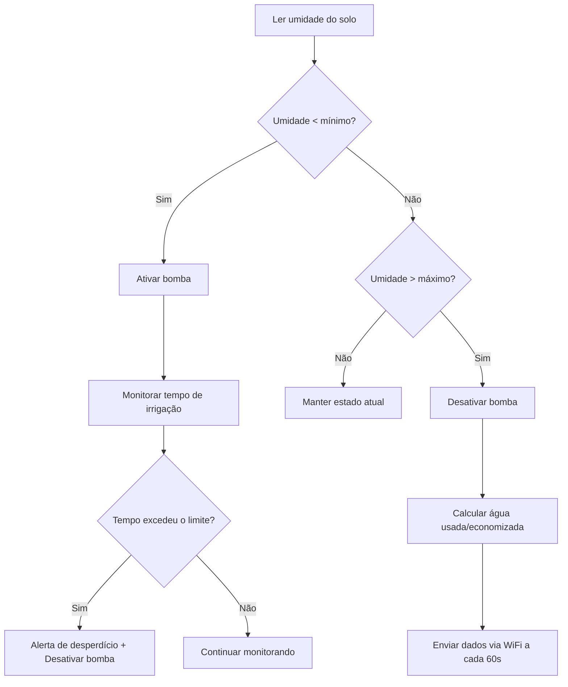

<h1 align="center">🌱 CERES</h1>
<h3 align="center">Sistema de Irrigação Automática Inteligente com Monitoramento de Desperdício de Água</h3>

<p align="center">
  Projeto desenvolvido para reduzir o desperdício de água na irrigação de plantações de pequeno e médio porte, através de automação, sensoriamento e envio de dados em tempo real.
</p>

<p align="center">
  
  
  
  
</p>

---

## 📌 Sobre o projeto

O **CERES** nasceu através do programa **Sebrae — Liga Jovem**, com o objetivo de resolver um problema real enfrentado por pequenos e médios produtores rurais: o **desperdício de água na irrigação**, causado por sistemas manuais ou sem qualquer critério técnico de acionamento.

O sistema utiliza um sensor de umidade do solo para decidir, de forma automática, quando ligar ou desligar a bomba de irrigação — evitando tanto o desperdício de água por excesso quanto o estresse hídrico das plantas por falta de rega. Além disso, o sistema monitora ativamente possíveis falhas (como uma bomba que fica ligada por tempo excessivo) e envia os dados coletados para um aplicativo/servidor remoto, permitindo acompanhamento em tempo real.

🏆 **Resultados:** 1º lugar nas etapas local e regional da competição **Liga Jovem**; finalista nacional na **Maratona Tech**.

---

## ⚙️ Como funciona

1. O sensor de umidade do solo é lido periodicamente (a cada 5 segundos, por padrão)
2. O sistema compara a leitura com limites mínimo e máximo de umidade configuráveis
3. Se a umidade estiver abaixo do limite mínimo, a bomba é **ativada**
4. Se estiver acima do limite máximo, a bomba é **desativada**
5. Um mecanismo de segurança monitora o tempo de irrigação contínua — se ultrapassar um limite máximo, o sistema entende como **possível desperdício** e desliga a bomba automaticamente, registrando o alerta
6. A cada 60 segundos (configurável), os dados coletados são enviados via **WiFi (HTTP POST/JSON)** para um servidor ou aplicativo, incluindo:
   - Umidade atual do solo
   - Status da bomba (ligada/desligada)
   - Tempo total de irrigação
   - Volume estimado de água usada e economizada
   - Número de vezes que o sistema irrigou ou evitou irrigar
   - Alertas de possível desperdício



---

## 🔩 Hardware necessário

| Componente | Observação |
|---|---|
| **ESP32** | Placa com WiFi integrado (obrigatório — Arduino Uno/Nano puro não possui WiFi) |
| Sensor de umidade do solo | Conectado a uma entrada analógica (ADC) |
| Módulo relé | Para acionamento da bomba d'água |
| Bomba d'água | Compatível com o relé utilizado |
| LED indicador | Sinaliza visualmente quando a irrigação está ativa |
| Fonte de energia solar (opcional) | Para operação autônoma em campo |

### Pinagem utilizada

| Pino | Componente |
|---|---|
| GPIO 34 | Sensor de umidade do solo (entrada analógica) |
| GPIO 26 | Relé da bomba d'água |
| GPIO 27 | LED de status |

---

## 💻 Software e dependências

- [Arduino IDE](https://www.arduino.cc/en/software) (ou PlatformIO)
- Suporte a placas **ESP32** instalado na IDE
- Bibliotecas:
  - `WiFi.h` (nativa do core ESP32)
  - `HTTPClient.h` (nativa do core ESP32)

---

## 🚀 Instalação e configuração

1. Clone este repositório:
   ```bash
   git clone https://github.com/BrunoGarutti/CERES.git
   ```
2. Abra o arquivo `.ino` na Arduino IDE
3. Configure suas credenciais de WiFi e o endereço do servidor no início do código:
   ```cpp
   const char* SSID_WIFI    = "NOME_DA_SUA_REDE";
   const char* SENHA_WIFI   = "SENHA_DA_SUA_REDE";
   const char* URL_SERVIDOR = "http://SEU_SERVIDOR.com/api/irrigacao";
   ```
4. Calibre o sensor de umidade para o seu solo específico, ajustando:
   ```cpp
   const int VALOR_SOLO_SECO   = 4095;
   const int VALOR_SOLO_UMIDO  = 1200;
   ```
5. Faça o upload do código para o ESP32
6. Abra o Monitor Serial (115200 baud) para acompanhar o funcionamento em tempo real

---

## 🛠️ Parâmetros configuráveis

| Parâmetro | Valor padrão | Descrição |
|---|---|---|
| `LIMITE_UMIDADE_MINIMA` | 30.0% | Abaixo disso, a irrigação é ativada |
| `LIMITE_UMIDADE_MAXIMA` | 70.0% | Acima disso, a irrigação é desativada |
| `INTERVALO_LEITURA` | 5000 ms | Frequência de leitura do sensor |
| `INTERVALO_ENVIO` | 60000 ms | Frequência de envio de dados ao servidor |
| `VAZAO_BOMBA_L_POR_MIN` | 2.0 L/min | Usado para estimar o volume de água utilizado |
| `TEMPO_MAX_IRRIGACAO_MS` | 10 min | Tempo máximo de irrigação contínua antes de disparar alerta de desperdício |

---

## 📡 Exemplo de dados enviados (JSON)

```json
{
  "umidade_solo": 42.5,
  "bomba_ligada": false,
  "tempo_total_irrigado_seg": 340,
  "agua_usada_litros": 11.33,
  "agua_economizada_litros": 4.20,
  "vezes_irrigou": 3,
  "vezes_evitou_irrigar": 2,
  "possivel_desperdicio": false,
  "timestamp_ms": 1234567
}
```

---

## 🧠 Tecnologias utilizadas

<p align="left">
  
  
  
  
  
</p>

---

## 👥 Equipe

Projeto desenvolvido em equipe através do programa **Sebrae — Liga Jovem**, com orientação de professor.

- **Bruno Matheus Garutti Pinto** — Co-fundador e Desenvolvedor 
- **Enrico Delesporte** — Co-fundador e Desenvolvedor 
- **Henry Okahama de Queiroz** — Co-fundador e Desenvolvedor 
- **Rafael Mauro** — Co-fundador e Desenvolvedor 
- **João Vitor Novais** — Co-fundador e Coordenador 

---

<p align="center">Feito com 💧 e código para um futuro mais sustentável.</p>
